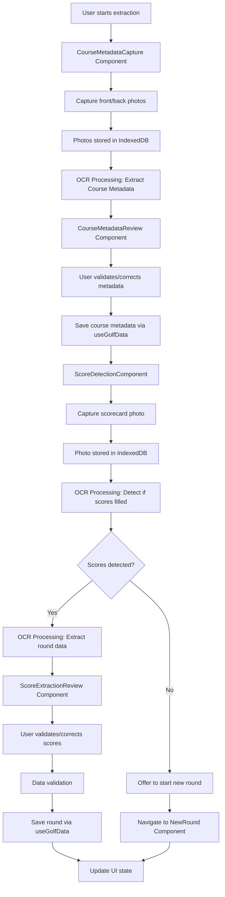
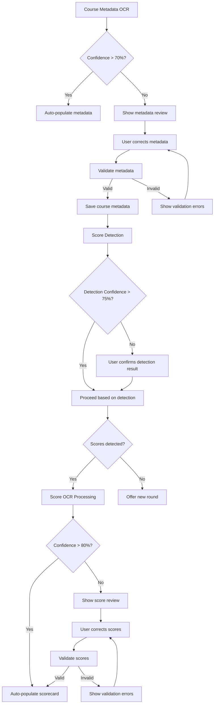

# Scorecard Photo Extraction Feature Architecture

## Overview

The scorecard photo extraction feature enables users to capture photos of physical golf scorecards in two distinct phases: (1) Extract and validate course metadata (such as course name, par ratings, and layout) from front/back photos, and (2) Detect if the scorecard has scores filled in; if scores are present, extract and validate the round data; if not, offer to start a new round. Due to OCR unreliability, the feature incorporates human-in-the-loop validation at key points. This feature integrates seamlessly with the existing Golf Tracking PWA, maintaining offline capability and mobile-first design principles.

## UI Components

### CourseMetadataCapture Component
- **Purpose**: Capture front and back photos of scorecard for course metadata extraction
- **Features**:
  - Camera access with mobile-optimized interface
  - Real-time preview with cropping guidelines for scorecard regions
  - Flash/torch control for low-light conditions
  - Orientation lock for consistent capture
  - Instructions for front/back photo capture
- **Mobile-first considerations**:
  - Full-screen camera view on mobile
  - Touch-friendly controls
  - Swipe gestures for navigation between front/back capture

### CourseMetadataReview Component
- **Purpose**: Review and validate extracted course metadata
- **Features**:
  - Photo previews with highlighted extracted text regions
  - Editable fields for course name, par ratings, hole details
  - Confidence indicators for extracted data
  - Manual correction interface for OCR errors
- **Layout**: Side-by-side photo and metadata review on desktop, stacked on mobile

### ScoreDetectionComponent
- **Purpose**: Analyze scorecard photo to detect if scores are filled
- **Features**:
  - Visual indicators of detected score regions
  - Confidence score for detection accuracy
  - Option to proceed with score extraction or start new round
- **Layout**: Overlay detection results on scorecard photo

### ScoreExtractionReview Component
- **Purpose**: Review and validate extracted round data (when scores are detected)
- **Features**:
  - Photo preview with highlighted score regions
  - Editable scorecard with extracted scores
  - Confidence indicators per hole
  - Manual correction interface
- **Layout**: Side-by-side photo and scorecard review on desktop, stacked on mobile

### ScorecardExtraction Component
- **Purpose**: Main container orchestrating the two-phase extraction flow
- **Features**:
  - Step-by-step wizard interface with branching logic
  - Progress indicators for each phase
  - Back/forward navigation
  - Conditional flow based on score detection results
  - Integration with course selection and round creation

## Data Flow



### Data Structures

#### PhotoMetadata
```typescript
interface PhotoMetadata {
  id: string;
  courseId?: string;
  timestamp: number;
  imageData: Blob;
  photoType: 'course_front' | 'course_back' | 'scorecard';
  ocrConfidence: number;
  processingStatus: 'pending' | 'processing' | 'completed' | 'failed';
}
```

#### CourseMetadata
```typescript
interface CourseMetadata {
  courseName: string;
  parRatings: number[]; // Array of par values for each hole
  holeDetails: {
    holeNumber: number;
    par: number;
    distance?: number;
    handicap?: number;
  }[];
  totalPar: number;
  confidence: number; // 0-1
}
```

#### DetectionResult
```typescript
interface DetectionResult {
  hasScores: boolean;
  confidence: number; // 0-1
  detectedScoreRegions?: {
    holeNumber: number;
    boundingBox: { x: number; y: number; width: number; height: number };
  }[];
}
```

#### ExtractedScoreData
```typescript
interface ExtractedScoreData {
  holeNumber: number;
  score: number | null;
  confidence: number; // 0-1
  boundingBox?: { x: number; y: number; width: number; height: number };
}
```

## OCR Processing Pipeline

### Tesseract.js Integration

#### Dependencies
- `tesseract.js` for OCR processing
- `opencv.js` for image preprocessing (optional enhancement)

#### Pipeline Steps

1. **Image Preprocessing**
    ```javascript
    // Pseudocode
    function preprocessImage(imageBlob) {
      // Convert to grayscale
      const grayImage = await convertToGrayscale(imageBlob);

      // Enhance contrast
      const enhanced = await enhanceContrast(grayImage);

      // Detect scorecard region
      const cropped = await detectScorecardRegion(enhanced);

      return cropped;
    }
    ```

2. **Score Detection (for scorecard photos)**
    ```javascript
    // Pseudocode
    async function detectScoresFilled(imageBlob) {
      const { createWorker } = Tesseract;
      const worker = await createWorker('eng');

      // Configure for detecting numeric patterns
      await worker.setParameters({
        tessedit_char_whitelist: '0123456789',
        tessedit_pageseg_mode: PSM.SPARSE_TEXT
      });

      const { data } = await worker.recognize(imageBlob);
      const text = data.text;
      const confidence = data.confidence / 100;

      // Analyze text for score patterns (numbers in score columns)
      const hasScores = detectScorePatterns(text);
      const regions = extractScoreRegions(data.words);

      await worker.terminate();

      return {
        hasScores,
        confidence,
        detectedScoreRegions: regions
      };
    }

    function detectScorePatterns(text) {
      // Look for patterns like multiple numbers per line, score ranges, etc.
      const lines = text.split('\n');
      let scoreIndicators = 0;

      for (const line of lines) {
        const numbers = line.match(/\d+/g);
        if (numbers && numbers.length >= 2) { // Hole number + score
          scoreIndicators++;
        }
      }

      return scoreIndicators > 3; // Threshold for considering scores present
    }
    ```

3. **OCR Processing for Metadata/Score Extraction**
    ```javascript
    // Pseudocode
    async function processScorecardOCR(imageBlob, mode) {
      const { createWorker } = Tesseract;
      const worker = await createWorker('eng');

      if (mode === 'metadata') {
        // Configure for course information
        await worker.setParameters({
          tessedit_char_whitelist: 'ABCDEFGHIJKLMNOPQRSTUVWXYZabcdefghijklmnopqrstuvwxyz0123456789 ',
          tessedit_pageseg_mode: PSM.AUTO
        });
      } else if (mode === 'scores') {
        // Configure for scorecard text
        await worker.setParameters({
          tessedit_char_whitelist: '0123456789',
          tessedit_pageseg_mode: PSM.SINGLE_BLOCK
        });
      }

      const { data } = await worker.recognize(imageBlob);
      const extractedText = data.text;

      await worker.terminate();

      if (mode === 'metadata') {
        return parseCourseMetadata(extractedText);
      } else {
        return parseScorecardText(extractedText);
      }
    }
    ```

4. **Text Parsing for Course Metadata**
    ```javascript
    // Pseudocode
    function parseCourseMetadata(text) {
      const lines = text.split('\n');
      let courseName = '';
      const parRatings = [];
      const holeDetails = [];

      for (const line of lines) {
        // Extract course name
        const nameMatch = line.match(/Course:?\s*(.+)/i);
        if (nameMatch) {
          courseName = nameMatch[1].trim();
        }

        // Extract par information
        const parMatch = line.match(/Par:?\s*(\d+)/i);
        if (parMatch) {
          parRatings.push(parseInt(parMatch[1]));
        }

        // Extract hole details
        const holeMatch = line.match(/Hole\s*(\d+).*?Par\s*(\d+)/i);
        if (holeMatch) {
          holeDetails.push({
            holeNumber: parseInt(holeMatch[1]),
            par: parseInt(holeMatch[2])
          });
        }
      }

      return {
        courseName,
        parRatings,
        holeDetails,
        totalPar: parRatings.reduce((sum, par) => sum + par, 0),
        confidence: calculateOverallConfidence(text)
      };
    }
    ```

5. **Text Parsing for Scores**
    ```javascript
    // Pseudocode
    function parseScorecardText(text) {
      const lines = text.split('\n');
      const scores = [];

      for (const line of lines) {
        const holeMatch = line.match(/Hole\s*(\d+)/i);
        const scoreMatch = line.match(/Score:?\s*(\d+)/i);

        if (holeMatch && scoreMatch) {
          scores.push({
            holeNumber: parseInt(holeMatch[1]),
            score: parseInt(scoreMatch[1]),
            confidence: calculateConfidence(line)
          });
        }
      }

      return scores;
    }
    ```

### Offline Processing
- All OCR processing occurs client-side
- No external API dependencies
- Results cached in IndexedDB for offline review

## Integration Points

### Existing Code Integration

#### useGolfData Hook Extensions
```typescript
// Add to useGolfData.ts
const saveExtractedCourseMetadata = async (metadata: CourseMetadata) => {
  // Create or update course based on extracted metadata
  const courseData = {
    name: metadata.courseName,
    par: metadata.totalPar,
    holes: metadata.holeDetails,
    // Additional fields as needed
  };

  // Check if course exists, update or create
  const existingCourse = await findCourseByName(metadata.courseName);
  if (existingCourse) {
    await updateCourse(existingCourse.id, courseData);
    return existingCourse.id;
  } else {
    const newCourseId = await createCourse(courseData);
    return newCourseId;
  }
};

const saveExtractedRound = async (courseId: string, extractedData: ExtractedScoreData[]) => {
  const roundData = {
    date: new Date().toISOString().split('T')[0],
    courseId,
    teeBox: 'Regular', // Default, user can modify
    holeScores: extractedData.map(data => ({
      holeNumber: data.holeNumber,
      score: data.score,
      putts: null, // Not extractable from photo
      fairwayHit: 'n/a',
      greenInRegulation: false,
      penaltyStrokes: 0
    }))
  };

  await saveRound(roundData);
};
```

#### Courses Component Enhancement
- Add "Extract from Photo" button to course cards
- Route to new scorecard extraction flow

#### Navigation Updates
- Add new route: `/courses/:id/extract-scorecard`
- Update tab navigation if needed

### Database Extensions
Add new IndexedDB stores:
- `scorecardPhotos`: Store captured images and metadata
- `extractionResults`: Cache OCR results with confidence scores

## Error Handling

### OCR Processing Errors
- **Low Confidence Scores**: Alert user, suggest manual entry
- **No Text Detected**: Prompt for better photo quality
- **Invalid Scorecard Format**: Provide guidance on expected layout

### Detection Errors
- **Uncertain Detection**: Low confidence in score presence detection, prompt user confirmation
- **Ambiguous Results**: Multiple possible interpretations, show options to user
- **Failed Detection**: Unable to analyze photo, suggest retaking or manual mode

### Metadata Extraction Errors
- **Incomplete Course Info**: Missing course name or par details, highlight missing fields
- **Inconsistent Data**: Par totals don't match hole pars, flag for correction
- **Low Confidence Metadata**: Suggest manual entry for critical fields

### Camera Access Errors
- **Permission Denied**: Clear instructions to enable camera
- **No Camera Available**: Fallback to file upload
- **Poor Lighting**: Real-time feedback during capture

### Data Validation Errors
- **Invalid Scores**: Highlight problematic holes
- **Missing Holes**: Warn about incomplete data
- **Course Mismatch**: Verify extracted data matches selected course
- **Metadata Validation**: Ensure course data is complete and accurate

### Error Recovery Flow


## User Experience Considerations

### Mobile-First Design
- **Touch Interactions**: Large buttons, swipe gestures
- **Camera Optimization**: Native camera API usage
- **Performance**: Lazy load OCR worker, progress indicators
- **Accessibility**: Screen reader support, high contrast mode

### Human-in-the-Loop Validation
- **Metadata Validation**: User review and correction of extracted course information
- **Score Validation**: Manual verification of extracted scores with confidence indicators
- **Detection Confirmation**: User confirmation when score detection confidence is low
- **Progressive Disclosure**: Show extracted data with clear edit options

### Offline Capabilities
- **Local Processing**: All OCR and detection happens offline
- **Data Persistence**: Photos, metadata, and detection results stored locally
- **Sync on Reconnect**: Queue processed data for upload
- **Fallback Options**: Manual entry when OCR fails or detection is uncertain

### Progressive Enhancement
- **Camera Support**: Graceful degradation to file upload
- **OCR Availability**: Fallback to manual entry
- **Detection Fallback**: When detection fails, offer both score extraction and new round options
- **Storage Limits**: Handle IndexedDB quota exceeded

## Technical Implementation Details

### Performance Optimization
- **Worker Threads**: Run OCR in Web Worker to avoid blocking UI
- **Image Compression**: Reduce photo size before processing
- **Caching**: Cache OCR results to avoid reprocessing
- **Memory Management**: Clean up large image data after processing

### Security Considerations
- **Local Processing**: No sensitive data sent to external servers
- **Permission Management**: Clear camera permission requests
- **Data Privacy**: Photos stored locally, user-controlled deletion

### Browser Compatibility
- **Camera API**: Modern mobile browsers
- **Web Workers**: Required for OCR performance
- **IndexedDB**: Fallback to localStorage if needed
- **Progressive Web App**: Service worker integration

## Testing Strategy

### Unit Tests
- OCR text parsing functions for metadata and scores
- Score detection logic and pattern recognition
- Data validation logic for course metadata and scores
- Error handling scenarios for detection failures
- Confidence calculation functions

### Integration Tests
- Camera permission flows
- OCR processing pipeline for both metadata and score extraction
- Score detection integration with OCR results
- Data saving to course and round structures
- Conditional flow based on detection results

### E2E Tests
- Complete course metadata extraction and validation flow
- Score detection and conditional branching flow
- Score extraction and round save flow
- New round creation when no scores detected
- Offline functionality for all phases
- Mobile device testing across different screen sizes

## Deployment Considerations

### Bundle Size Impact
- Tesseract.js: ~5MB (consider lazy loading)
- OpenCV.js: Additional 2MB (optional)
- Tree shaking to minimize unused code
- Additional detection logic: Minimal impact

### Performance Considerations
- OCR processing time increased for two-phase extraction
- Detection step adds ~1-2 seconds to scorecard processing
- Optimize worker thread usage for parallel processing

### CDN Integration
- Host OCR models on CDN for faster loading
- Cache models in service worker
- Consider separate model loading for metadata vs score OCR

### Feature Flags
- Enable/disable feature based on browser capabilities
- Separate flags for course metadata extraction and score detection
- A/B testing for UX optimization and detection accuracy

## Future Enhancements

### Advanced OCR
- Template matching for specific scorecard formats
- Machine learning model for better accuracy and detection
- Multi-language support for international courses

### Enhanced Detection
- Improved score presence detection using computer vision
- Course type recognition (e.g., par 3, executive)
- Automatic scorecard layout analysis

### Enhanced Features
- Batch processing multiple scorecards
- Scorecard template creation and reuse
- Course metadata enrichment from external APIs
- Integration with golf apps and course databases

### Analytics
- OCR success rates by phase (metadata vs scores)
- Detection accuracy metrics
- User correction patterns and confidence thresholds
- Performance metrics for each processing step

---

This revised architecture splits the scorecard photo extraction into two phases with intelligent detection and human-in-the-loop validation, maintaining the existing PWA's principles while providing robust course metadata management and conditional round creation based on score presence detection.